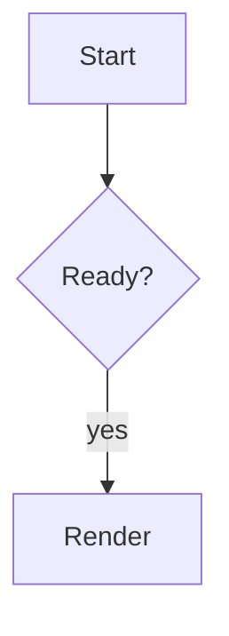

# GitHub-Flavored Markdown Example

## Text styling

**Strong text**, __strong text with underscores__, *emphasized text*,
_emphasized text with underscores_, ***combined emphasis***,
**strong text with _nested emphasis_**, ~~strikethrough text~~, `inline code`,
and escaped punctuation like \*not emphasis\*.

<sub>Subscript text</sub>, <sup>Superscript text</sup>, and
<ins>underlined text</ins>.

<kbd>Command</kbd> + <kbd>K</kbd> keyboard input elements.<br>
HTML line break.

Color models in code spans: `#0969DA`, `rgb(9, 105, 218)`,
and `hsl(212, 92%, 45%)`.

## Links and Images

Autolinks: https://example.com, www.example.org, user@example.com.

[Reference links][reference link] and [inline links](https://www.markdownguide.org/basic-syntax/#links "alt text").

Relative links can point to [a local document](./hello.md), a [parent
document](../../../README.md), or a [repository-root path](/README.md).

Section links can point to [the tables section](#tables) and
[the duplicate heading](#duplicate-heading).


[](https://www.wikimedia.org)


[reference link]: https://www.markdownguide.org/basic-syntax/#reference-style-links

## Headings

# H1

## H2

### H3

#### H4

##### H5

###### H6

### Duplicate Heading

### Duplicate Heading

### Punctuation, Unicode, and _formatting_ in Heading IDs: Θ!

## Paragraphs and Breaks

Paragraph text wraps across source lines
without creating a hard line break.

This line ends with two trailing spaces.  
The next line should be separated by a hard break.

This line ends with a backslash.\
The next line should also be separated by a hard break.

## Horizontal Rules

---

***

___

## Blockquotes

> A blockquote can contain **formatting**.
>
> - nested list item
> - another item
>
> > nested quote

## Lists

1. First ordered item
2. Second ordered item
   1. Nested ordered item
   2. Another nested item

100. Ordered item starting at one hundred
101. Next ordered item

- Dash unordered item
* Asterisk unordered item
+ Plus unordered item

- Parent item
  - Nested unordered item
  - Another nested unordered item
    - Deep nested unordered item

- [x] Completed task
- [ ] Incomplete task
- [X] Capital checked task
- [ ] \(Optional) escaped leading parenthesis

## Tables

| Left | Center | Right |
| :--- | :----: | ----: |
| one | two | three |
| **bold** | `code` | [link](https://example.com) |

| Command | Description |
| --- | --- |
| `git status` | List all *new or modified* files |
| `git diff` | Show file differences that **have not been** staged |

Left-aligned | Center-aligned | Right-aligned
:--- | :---: | ---:
git status | git status | git status
git diff | git diff | git diff

| Escaped pipe | Missing value | Extra value |
| --- | --- | --- |
| A \| B | present | ignored? |
| only one cell |
| one | two | three | four |

| Feature | Linux | macOS | Windows | Notes | Identifier | Owner | Status | Last reviewed |
| --- | --- | --- | --- | --- | --- | --- | --- | --- |
| Very long configuration name that should make the table wider than a narrow viewport | supported | supported | partial | This cell contains a long unbroken token: abcdefghijklmnopqrstuvwxyzABCDEFGHIJKLMNOPQRSTUVWXYZ0123456789 | CFG-000000000000000000000000000001 | platform-team | active | 2026-04-30 |
| Another wide row | yes | yes | yes | This row includes inline `code`, **strong text**, and [a link](https://example.com). | CFG-000000000000000000000000000002 | docs-team | pending | 2026-05-01 |

This paragraph is immediately followed by table-looking text.
| Adjacent header | Adjacent value |
| --- | --- |

## Code

Indented code:

    package main

    func main() {}

Fenced code:

```go
package main

import "fmt"

func main() {
	fmt.Println("hello")
}
```

Fence without a language:

```
plain fenced code
```

Tilde fence:

~~~bash
printf '%s\n' "hello"
~~~

Fence with a longer info string:

```go title="main.go"
package main
```

Markdown delimiters inside code are not rendered:

```markdown
# Not a heading

**Not bold**

- [ ] Not a task
```

## Diagrams

Mermaid:



GeoJSON:

```geojson
{
  "type": "Feature",
  "geometry": {
    "type": "Point",
    "coordinates": [125.6, 10.1]
  },
  "properties": {
    "name": "Dinagat Islands"
  }
}
```

TopoJSON:

```topojson
{
  "type": "Topology",
  "objects": {
    "example": {
      "type": "GeometryCollection",
      "geometries": [
        {
          "type": "Point",
          "properties": {"name": "example"},
          "coordinates": [4000, 5000]
        }
      ]
    }
  },
  "arcs": []
}
```

ASCII STL:

```stl
solid cube_corner
  facet normal 0 0 0
    outer loop
      vertex 0 0 0
      vertex 1 0 0
      vertex 0 1 0
    endloop
  endfacet
endsolid cube_corner
```

## Mathematical Expressions

Inline math: $E = mc^2$.

Block math:

$$
\int_0^1 x^2 dx = \frac{1}{3}
$$

## Footnotes

Here is a sentence with a footnote.[^first]

Here is another reference to the same footnote.[^first]

A second footnote has multiple source lines.[^second]

[^first]: This is the first footnote body.

[^second]: This footnote has a first line.  
    This footnote has a second line.

## GitHub-Flavored Extensions

Alerts:

> [!NOTE]
> Useful information that users should know, even when skimming content.

> [!TIP]
> Helpful advice for doing things better or more easily.

> [!IMPORTANT]
> Key information users need to know to achieve their goal.

> [!WARNING]
> Urgent information that needs immediate user attention to avoid problems.

> [!CAUTION]
> Advises about risks or negative outcomes of certain actions.

Mentions and references: @octocat, @github/support, #123, GH-456, and
owner/repo#789.

Custom external references: JIRA-123, Zendesk-456.

Emoji shortcodes: :sparkles: :shipit: :warning: :+1:

## Raw HTML

<details>
<summary>Expandable details</summary>

Details content can include **Markdown formatting**.
</details>


<picture>
  <source media="(prefers-color-scheme: dark)" srcset="markdown_pink.png">
  
</picture>

HTML comments can hide content.

<!-- This sentence is hidden in rendered GitHub Markdown. -->

<!-- --><script>alert("embedded comment terminator")</script><!-- -->

Escaped raw HTML remains visible as text:

\<details\>escaped details\</details\>
