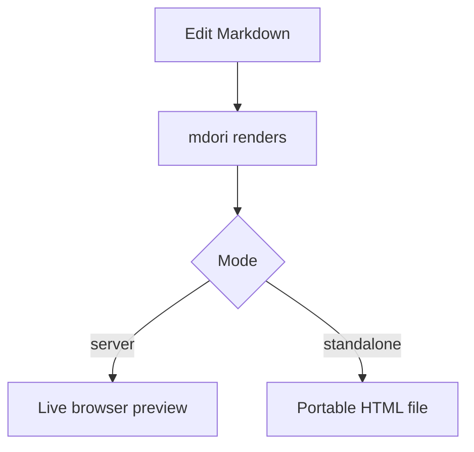

# mdori Rendering Examples

[Home](index.html) · [GitHub](https://github.com/elh/mdori)

This page is Markdown rendered by mdori. It collects the core features that are
useful when previewing project notes, READMEs, technical docs, and exported
standalone HTML.

## Text styling

**Strong text**, *emphasized text*, ***combined emphasis***,
**strong text with _nested emphasis_**, ~~strikethrough text~~, and `inline code`.

<sub>Subscript text</sub>, <sup>Superscript text</sup>, and
<ins>underlined text</ins>.

Keyboard input: <kbd>Command</kbd> + <kbd>K</kbd>.

Autolinks: https://example.com, www.example.org, user@example.com.

## Lists

1. First ordered item
2. Second ordered item
   1. Nested ordered item
   2. Another nested item

- Dash unordered item
- Another unordered item
  - Nested unordered item

- [x] Completed task
- [ ] Incomplete task
- [X] Capital checked task

## Tables

| Command | Description |
| --- | --- |
| `mdori README.md` | Preview a Markdown file locally with live reload |
| `mdori -o out.html README.md` | Render a standalone HTML file and exit |
| `mdori -preview README.md` | Render a temporary standalone HTML preview |

| Feature | Linux | macOS | Windows | Notes |
| --- | --- | --- | --- | --- |
| Live preview | supported | supported | supported | Watches the source Markdown file and reloads the browser |
| Standalone export | supported | supported | supported | Inlines the browser runtime needed by the rendered document |
| Directory-aware links | supported | supported | supported | Applies to server mode, not standalone export |

## Code

Fenced Go code:

```go
package main

import "fmt"

func main() {
	fmt.Println("hello from mdori")
}
```

Shell commands:

```bash
go install github.com/elh/mdori/cmd/mdori@latest
mdori README.md
```

Markdown inside a code fence stays literal:

```markdown
# Not a heading

**Not bold**

- [ ] Not a task
```

## Alerts

> [!NOTE]
> mdori supports GitHub-style Markdown alerts.

> [!TIP]
> Use `-o` when you want a portable HTML file.

> [!IMPORTANT]
> Server mode is the best fit when local Markdown links and relative assets
> should resolve from a directory tree.

> [!WARNING]
> Standalone export renders one document at a time and does not rewrite linked
> Markdown files.

> [!CAUTION]
> The live preview server is intended for local use, not for hosting untrusted
> inputs.

## Mermaid



## Math

Inline math: $E = mc^2$.

Block math:

$$
\int_0^1 x^2 dx = \frac{1}{3}
$$

## Images

Relative image paths are preserved in the rendered document.


## Footnotes

mdori supports footnotes through goldmark.[^goldmark]

A second reference can appear later in the document.[^standalone]

[^goldmark]: mdori uses goldmark with GitHub-flavored Markdown extensions.

[^standalone]: Standalone export emits a single HTML file for the source
    Markdown document.

## Safe raw HTML

<details>
<summary>Expandable details</summary>

Details content can include **Markdown formatting**.
</details>

Escaped raw HTML remains visible as text:

\<details\>escaped details\</details\>

## Limitations

- Mermaid support uses beautiful-mermaid's subset, not full Mermaid.
- GeoJSON/TopoJSON/STL diagrams are not rendered as diagrams.
- Emoji shortcodes and repository-specific autolinks are not supported.
